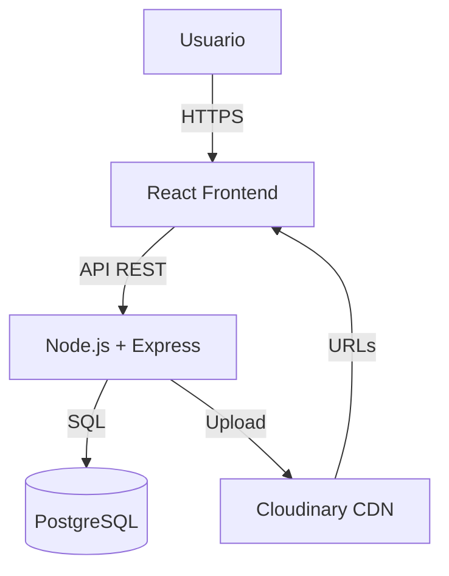

# ADR-01: Decisiones arquitectónicas iniciales de MangaView

| Campo  | Valor |
|--------|-------|
| Autor  | Roberto |
| Fecha  | 08/05/2025 |
| Estado | `Aceptado` |

---

## Contexto

MangaView es una plataforma web para leer manga en linea dirigida a lectores de habla hispana. El problema principal es que no existe un sitio en español que centralice el contenido, guarde el progreso del usuario y ofrezca una experiencia limpia sin publicidad invasiva.

---

## Decisión

Se eligió un stack basado en React + TypeScript para el frontend, Node.js con Express para el backend, PostgreSQL como base de datos relacional y Cloudinary como CDN de imágenes.

### ¿Por qué?

React permite construir el visor de páginas con componentes reutilizables. Node.js maneja bien muchas peticiones concurrentes. PostgreSQL encaja con el modelo relacional del sistema. Cloudinary evita saturar el servidor con imágenes pesadas.

### Alternativas consideradas

| Alternativa | Por qué la descarté |
|-------------|---------------------|
| Vue.js | Menor ecosistema y menos demanda laboral |
| Django | Demasiado para solo una API, rompe la uniformidad JS |
| MongoDB | El modelo de datos tiene relaciones claras que favorecen SQL |
| Servidor propio para imágenes | Alto costo de almacenamiento sin ventajas de CDN |

---

## Consecuencias

**Lo que gano:** Stack JS unificado, integridad relacional en PostgreSQL, imágenes rápidas con Cloudinary, API escalable a móvil.

**Lo que sacrifico:** PostgreSQL requiere esquema definido desde el inicio. Cloudinary es dependencia externa de pago. Node no es ideal para cómputo intensivo.

## Diagrama

