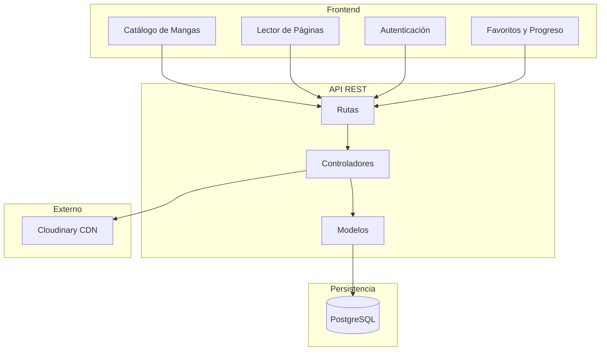
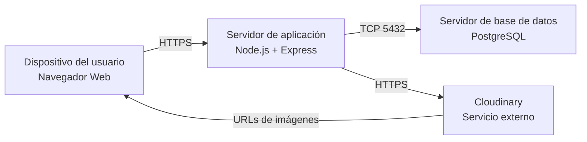
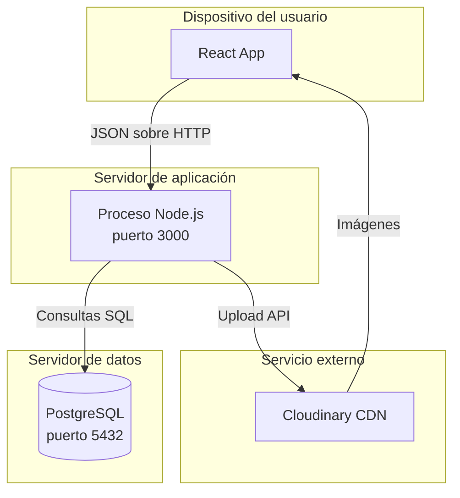
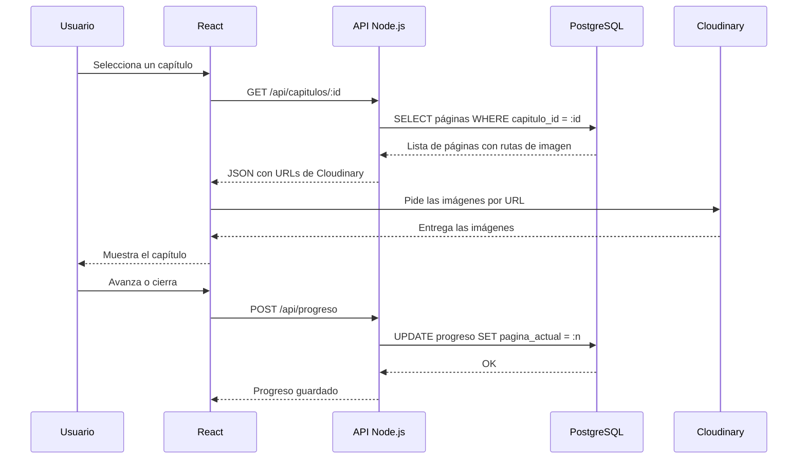

# ADR-02: Vistas arquitectónicas del sistema

| Campo  | Valor |
|--------|-------|
| Autor  | Roberto |
| Fecha  | 04/06/2026 |
| Estado | `Aceptado` |

---

## Contexto

MangaView es una app web para leer manga. Tiene un frontend en React, una API en Node.js con Express, una base de datos en PostgreSQL y usa Cloudinary para las imágenes.

Hasta ahorita solo habia documentado qué tecnologías use y por qué. Pero eso no es suficiente para entender cómo funciona el sistema completo. Necesitaba una forma de mostrar cómo está organizado el código, dónde corre, cómo se despliega y cómo se comunican las partes cuando alguien está leyendo un manga. Por eso decidi documentar las vistas arquitectónicas.

---

## Decisión

Voy a usar las cuatro vistas del modelo 4+1: vista lógica, vista física, vista de despliegue y vista de procesos.

### ¿Por qué?

Cada vista responde una pregunta distinta y juntas dan una imagen completa del sistema sin repetir información.

La vista lógica muestra cómo está dividido el código en partes. La física muestra en qué máquinas corre. La de despliegue muestra cómo los servicios se montan sobre esa infraestructura. Y la de procesos muestra qué pasa exactamente cuando un usuario abre un capítulo, paso a paso.

Si solo hiciera un diagrama mezclaría todo y sería confuso. Con las cuatro separadas es más fácil explicar cada parte sin que interfiera con las demás.

### Alternativas consideradas

| Alternativa | Por qué la descarté |
|-------------|---------------------|
| Solo el diagrama C4 que ya tenía | Muestra bien la estructura pero no dice nada de cómo fluyen las peticiones en tiempo real |
| Solo diagrama de clases UML | Describe el código pero ignora completamente la infraestructura y los procesos |
| No hacer vistas y dejar solo el código | Nadie que no conozca el proyecto podría entender cómo funciona sin leerlo completo |

---

## Consecuencias

**Lo que gano:**

Con estas cuatro vistas cualquier persona puede entender el sistema desde distintos angulos sin necesidad de meterse al código. También me ayuda a mi mismo a tener claro cómo está organizado todo antes de seguir desarrollando.

**Lo que sacrifico:**

Son cuatro diagramas que tengo que mantener actualizados cada que el sistema cambie. Si no los actualizo se vuelven inútiles o peor, engañosos. Para un proyecto de este tamaño es bastante documentación, pero es lo que pide la materia y tampoco está de más practicarlo.

---

## Diagramas

### Vista lógica

Cómo está organizado el sistema en capas y qué componentes hay en cada una.

---

### Vista física

Los nodos de infraestructura donde corre el sistema.

---

### Vista de despliegue

Cómo están desplegados los servicios sobre la infraestructura.

---

### Vista de procesos

Lo que pasa cuando un usuario abre y lee un capítulo de manga.

---

## Declaración de uso de IA

Use IA (Claude de Anthropic) para ayudarme a redactar y estructurar este documento. Las decisiones y el contenido son del proyecto que he estado desarrollando durante el cuatrimestre. Revise todo antes de subirlo.

<!-- Rama: integracion-de-apis — aquí se aplican las 4 vistas arquitectónicas -->
