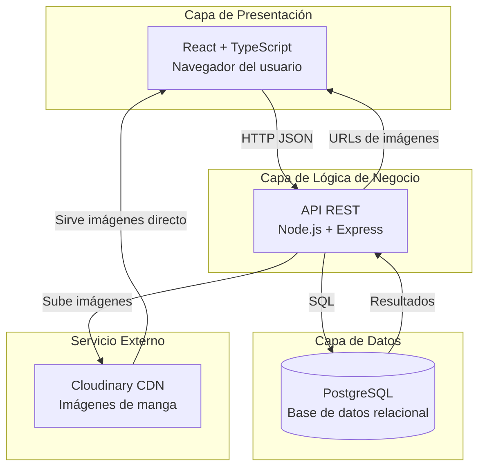

# ADR-03: Estilo arquitectónico del sistema

| Campo  | Valor |
|--------|-------|
| Autor  | Roberto |
| Fecha  | 04/06/2026 |
| Estado | `Aceptado` |

---

## Contexto

MangaView es una plataforma web para leer manga en linea. El sistema tiene un frontend en React, una API en Node.js con Express, una base de datos PostgreSQL y usa Cloudinary para las imágenes. Los usuarios principales son lectores hispanohablantes que quieren leer manga sin perder su progreso entre sesiones.

Para esta etapa necesitaba definir formalmente qué estilo arquitectónico guía la estructura del sistema, porque hasta ahorita lo había elegido de forma intuitiva sin documentarlo.

---

## Decisión

El estilo arquitectónico elegido es **cliente-servidor en capas**.

El sistema se divide en tres capas principales: presentación (React en el navegador del usuario), lógica de negocio (API REST en Node.js) y datos (PostgreSQL). Cloudinary actúa como servicio externo al que acceden tanto el backend como el cliente directamente para las imágenes.

### ¿Por qué?

La separación en capas hace que cada parte del sistema tenga una responsabilidad clara. El frontend solo se preocupa por mostrar datos y manejar la interfaz. El backend solo se preocupa por procesar peticiones y aplicar reglas. La base de datos solo guarda y entrega información.

Esto importa para MangaView porque el visor de páginas, el catálogo y el sistema de progreso son funciones bastante distintas. Tenerlas en capas separadas hace más fácil trabajar en una sin romper las otras.

Además, la separación cliente-servidor permite que en el futuro se pueda conectar una app móvil al mismo backend sin reescribir nada, solo consumiendo la misma API.

### Alternativas consideradas

| Alternativa | Por qué la descarté |
|-------------|---------------------|
| Microservicios | Es demasiado complejo para el tamaño actual del proyecto. Implicaría múltiples servicios independientes con su propia base de datos, lo que tiene sentido a escala pero no para un proyecto académico de un solo desarrollador |
| Monolito tradicional (todo junto) | No hay separación entre frontend y backend, lo que dificulta escalar y mantener. Además no permitiría conectar una app móvil fácilmente en el futuro |
| Serverless | Las funciones serverless no mantienen estado entre peticiones, lo que complica guardar el progreso de lectura y manejar sesiones de usuario |
| Event-driven | El sistema no tiene flujos asíncronos complejos que justifiquen este estilo. Las peticiones de MangaView son simples solicitud-respuesta |

---

## Consecuencias

**Lo que gano:**

Cada capa se puede modificar o escalar sin afectar a las demás. Si el día de mañana necesito cambiar la base de datos o el framework del backend, el frontend no se entera. También hace más fácil hacer pruebas porque puedo probar cada capa por separado.

**Lo que sacrifico:**

Agregar una funcionalidad nueva a veces implica tocar las tres capas al mismo tiempo, lo que puede ser tedioso. También hay una latencia extra por la comunicación entre capas que en un monolito no existiría, aunque para este tipo de app no es un problema real.

---

## Diagrama

Cómo se aplica el estilo cliente-servidor en capas en MangaView.

---

## Declaración de uso de IA

Use IA (Claude de Anthropic) para ayudarme a redactar y estructurar este documento. Las decisiones son del proyecto que he desarrollado durante el cuatrimestre. Revise el contenido antes de subirlo.
