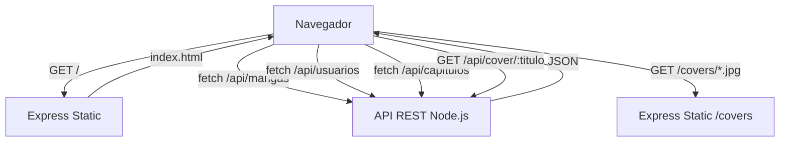

# ADR-05: Decisiones del Frontend de MangaView

| Campo  | Valor |
|--------|-------|
| Autor  | Roberto |
| Fecha  | 30/06/2026 |
| Estado | `Aceptado` |

---

## Contexto

MangaView necesitaba una interfaz de usuario para que los lectores pudieran explorar el catalogo, iniciar sesion, leer capitulos y gestionar sus favoritos. La decision principal fue elegir como construir el frontend considerando que el backend ya estaba en Node.js y el tiempo disponible era limitado.

---

## Decision

Se implemento el frontend como una **Single Page Application (SPA) en HTML, CSS y JavaScript vanilla**, sin frameworks adicionales. Toda la interfaz vive en un solo archivo `index.html` que se sirve directamente desde el servidor Express.

### Funcionalidades implementadas

- Catalogo de mangas con busqueda y filtros por tags
- Sistema de login y registro con validacion de correo
- Pagina de detalle con informacion completa, estadisticas y obras del autor
- Lista de capitulos por manga
- Lector de paginas con navegacion izquierda/derecha y teclado
- Sistema de favoritos por usuario
- Perfil de usuario
- Politica de privacidad
- Modo oscuro y claro
- Diseño responsive

### Por que HTML vanilla en vez de React?

El proyecto ya tenia un backend funcional y el tiempo restante del cuatrimestre era poco. Levantar un proyecto React implicaria configurar build tools, manejar dependencias y separar el proyecto en multiples archivos. Con HTML vanilla se pudo construir una SPA completa en un solo archivo sin instalacion adicional, sirviendo el frontend directamente desde Express con `express.static`.

### Alternativas consideradas

| Alternativa | Por que la descarte |
|-------------|---------------------|
| React + Vite | Requiere configuracion extra, build process y mas tiempo de desarrollo |
| Vue.js | Misma razon que React — overhead innecesario para el alcance del proyecto |
| Servidor de archivos separado | Complica el despliegue al tener dos servidores distintos |

---

## Consecuencias

**Lo que gano:**

El frontend se sirve desde el mismo servidor Express sin configuracion adicional. No hay dependencias de npm para el cliente. Cualquier persona puede abrir el proyecto con un solo `npm run dev`.

**Lo que sacrifico:**

A medida que el proyecto crezca, un solo archivo HTML se vuelve dificil de mantener. Si se necesitan mas paginas o componentes complejos, habria que migrar a React o Vue. Tambien se pierde la ventaja del tipado de TypeScript en el frontend.

---

## Diagrama

---

## Declaracion de uso de IA

Use IA (Claude de Anthropic) para ayudarme a construir y depurar el frontend, incluyendo el sistema de autenticacion, el lector de capitulos y la pagina de detalle de manga. Las decisiones de diseno y arquitectura corresponden al proyecto MangaView desarrollado durante el cuatrimestre. Revise el contenido antes de subirlo.
