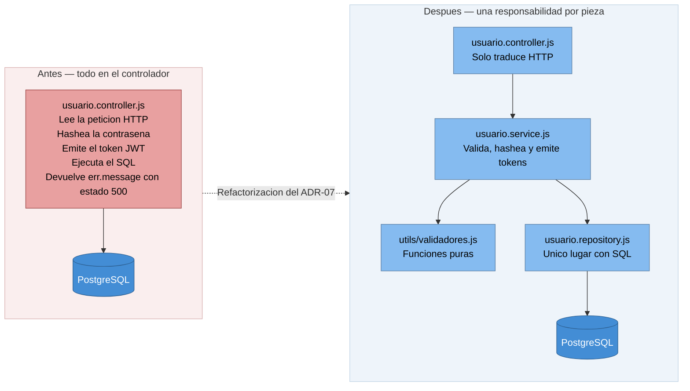

# ADR-07: Documentación final de la arquitectura y refactorización

| Campo  | Valor |
|--------|-------|
| Autor  | Roberto |
| Fecha  | 03/08/2026 |
| Estado | `Aceptado` |
| Sustituye a | Nada. Complementa al ADR-04 y paga la deuda 2 del ADR-06 |

---

## Contexto

Esta es la última unidad del cuatrimestre y el objetivo es consolidar la arquitectura de MangaView,
dejarla documentada y preparar una demo funcional. Al revisar el repositorio completo antes de escribir
nada, encontré que el problema principal no era el código sino **la distancia entre lo documentado y lo
que realmente se ejecuta**:

1. El `README.md` y los ADR-01 a ADR-03 describían un frontend en React, pero el frontend que se sirve es
   la SPA en JavaScript vanilla que decidí en el ADR-05. Los archivos de React siguen en el repositorio
   sin ejecutarse.
2. El ADR-04 documentaba los patrones Singleton y Observer como aplicados, pero su implementación vivía
   solo en la rama `patrones-gof` y nunca llegó a `main`.
3. El ADR-06, con las dos deudas técnicas identificadas, tampoco se había fusionado: vivía solo en la rama
   `deuda-tecnica`, así que el registro de decisiones estaba incompleto.
4. El entorno no era reproducible. Once scripts `setup*.js` hacían de migraciones y el estado final
   dependía del orden en que se hubieran ejecutado.
5. No había ninguna prueba ni integración continua.

La decisión de fondo de esta unidad fue **no maquillar nada**: documentar la arquitectura tal como es,
evaluarla con un método formal y refactorizar solo lo que la evaluación señalara, dejando por escrito lo
que quedara pendiente.

---

## Decisión 1 — Documentar la arquitectura con el modelo C4 como código

Los tres niveles del modelo C4 se escriben en Mermaid dentro de `docs/C4-MangaView.md`, junto al código
fuente y versionados con Git.

### ¿Por qué?

Un diagrama exportado como imagen se desactualiza el mismo día en que alguien toca el código, porque
actualizarlo exige abrir otra herramienta y volver a exportar. Al estar en texto dentro del repositorio,
el diagrama se modifica en el mismo commit que el código que describe y se revisa como cualquier otro
cambio. En esta misma unidad la regla ya se cumplió: la refactorización del backend y la actualización del
nivel 3 forman parte del mismo trabajo.

### Alternativas descartadas

| Alternativa | Por qué la descarté |
|-------------|---------------------|
| draw.io o Lucidchart exportando PNG | El diagrama deja de coincidir con el código en cuanto hay un cambio y no se puede revisar en un pull request |
| PlantUML con la librería C4 | Es más expresivo, pero necesita un renderizador aparte y GitHub no lo dibuja de forma nativa |
| Sintaxis `C4Context` de Mermaid | Es la notación C4 oficial, pero está marcada como experimental y no renderiza de forma fiable en GitHub. Se usa `flowchart` conservando los estereotipos y los colores de C4 |

---

## Decisión 2 — Evaluar con ATAM antes de tocar el código

La evaluación ATAM (`docs/ATAM-MangaView.md`) se hizo **antes** de la refactorización, y la refactorización
solo atendió lo que la evaluación identificó.

### ¿Por qué?

Sin una evaluación previa, refactorizar es cuestión de intuición y se termina arreglando lo que resulta
cómodo en lugar de lo que importa. ATAM obliga a partir de los atributos de calidad y a justificar cada
hallazgo con evidencia. El resultado fueron tres hallazgos, y solo uno de ellos exigía acción:

| Hallazgo | Qué se hizo |
|----------|-------------|
| R-01 Riesgo: aprovisionamiento no idempotente y sin orden declarado | Se corrigió (Decisión 4) |
| T-01 Trade-off: JWT sin estado, `logout` no revoca el acceso | Se aceptó de forma consciente y se documentó |
| S-01 Sensibilidad: factor de coste de bcrypt igual a 10 | Se mantuvo el valor y se externalizó (Decisión 7) |

Que dos de los tres hallazgos no deriven en cambios de código es parte del método: ATAM sirve tanto para
decidir qué tocar como para justificar qué dejar quieto.

---

## Decisión 3 — Recuperar los patrones GOF a la línea principal

Se integran `DatabaseSingleton` y `ProgresoObserver` en `main` en lugar de reescribir el ADR-04.

### ¿Por qué?

Había dos formas de eliminar la contradicción entre el ADR-04 y el código: corregir el documento para
decir que los patrones no se aplicaron, o llevar el código a donde el documento decía que estaba. La
segunda es la correcta, porque el trabajo estaba hecho y bien hecho; lo que falló fue la fusión de la
rama, no la decisión de diseño.

El Observer quedó conectado en `guardarProgreso`, que era su propósito original: el controlador emite el
evento y no sabe quién lo escucha.

### Alternativas descartadas

| Alternativa | Por qué la descarté |
|-------------|---------------------|
| Reescribir el ADR-04 diciendo que los patrones no se aplicaron | Habría descartado trabajo real y correcto por un problema de fusión |
| Fusionar la rama `patrones-gof` completa | Su base es anterior al frontend actual y provocaba conflictos en `index.html`. Se recuperaron los archivos citando en el commit los originales `2d779b3` y `a867baa` |

---

## Decisión 4 — Un único seed idempotente y transaccional

Los once scripts `setup.js` … `setup11.js` se sustituyen por `backend/src/db/seed.js`, con `schema.sql`
como fuente única del DDL y `reset.js` para reconstruir desde cero.

### ¿Por qué?

Es el riesgo R-01. Los scripts no eran pasos complementarios de una instalación sino intentos sucesivos de
arreglar a mano la misma columna: `setup4` revertía a `setup3` y `setup9` revertía a `setup8`. Además
ninguno insertaba Naruto, One Piece ni Attack on Titan, aunque `setup.js` cargaba capítulos apuntando a
esos identificadores, así que sobre una base de datos vacía el aprovisionamiento fallaba por violación de
clave foránea. En la práctica **el catálogo de la demo solo existía en mi computadora**.

El seed hace todo su trabajo dentro de una transacción y usa `ON CONFLICT`, para lo cual `schema.sql`
declara ahora las claves naturales que faltaban. Ejecutarlo una o diez veces deja el mismo resultado.

### Alternativas descartadas

| Alternativa | Por qué la descarté |
|-------------|---------------------|
| Una herramienta de migraciones como Knex o node-pg-migrate | Es lo correcto para un sistema que evoluciona en producción, pero para un esquema de seis tablas que ya está estable añade una dependencia y un concepto nuevo sin beneficio real |
| Conservar los scripts y documentar el orden | No resuelve la no idempotencia: repetir un paso seguiría duplicando datos |
| Una base de datos precargada en Docker | Obliga a instalar Docker para ver la demo, que es justo la clase de requisito que se quería quitar |

---

## Decisión 5 — Portadas generadas por el propio servidor

`mangas.portada_url` apunta a `/api/cover/:titulo`, que genera la portada como SVG en el servidor.

### ¿Por qué?

Es la única estrategia que funciona en un clon nuevo sin red, sin archivos binarios versionados y sin
pasos manuales. Las alternativas que había probado en los scripts antiguos fallaban todas: las URL
externas dependen de que el sitio siga sirviendo la imagen, y los archivos en disco no estaban
versionados y además se descargaban a una carpeta distinta de la que Express publicaba.

**Es un intercambio explícito**: se pierde la portada real del manga y se gana que el catálogo se vea
siempre bien en cualquier máquina. Para una demo evaluada, que nada aparezca roto vale más que la fidelidad
visual. La ruta `/covers` se corrigió y se conserva: si algún día se colocan imágenes reales ahí, basta
apuntar `portada_url` a ellas.

---

## Decisión 6 — Service Layer y Repository, primero en el módulo de usuarios

`usuario.controller.js` se separa en controlador, `usuario.service.js` y `usuario.repository.js`, con las
validaciones en `utils/validadores.js`. El servicio se construye con una fábrica que recibe sus
dependencias.

### ¿Por qué?

Es la deuda técnica 2 del ADR-06, que llevaba desde julio en estado de propuesta. El controlador de
usuarios mezclaba cuatro responsabilidades en la misma función: leer la petición HTTP, validar, hashear y
emitir el token, y ejecutar SQL. Era el más acoplado de los tres y el que hacía imposible probar nada por
separado.

La inyección de dependencias no es adorno: es lo que permite que las pruebas del Paso siguiente le pasen
al servicio un repositorio falso en memoria y **corran sin PostgreSQL**, tanto en mi máquina como en el
pipeline.

### Por qué solo en usuarios, y no en los tres módulos

Refactorizar `manga` y `capitulo` al mismo tiempo, sin pruebas que respalden el cambio, era arriesgar la
demo por una mejora que ninguno de los dos necesita con urgencia: sus consultas son de solo lectura y no
mezclan lógica de negocio. Se aplicó donde había un problema real y **el resto queda registrado abajo como
deuda planificada**, no escondido. El diagrama del nivel 3 dibuja esas dos flechas como deuda pendiente a
propósito.

---

## Decisión 7 — Externalizar los parámetros que ATAM señaló como sensibles

`BCRYPT_ROUNDS` y `JWT_EXPIRES_IN` pasan a variables de entorno documentadas en `.env.example`.

### ¿Por qué?

El punto de sensibilidad S-01 es un solo dígito escondido en una llamada a función. Un parámetro que mueve
la seguridad y la disponibilidad del sistema en direcciones opuestas no debe estar enterrado en el código
como número mágico: debe estar donde se vea que es una decisión. Los valores no cambian —siguen siendo 10
y 7 días—, cambia su visibilidad.

---

## Cómo quedó el módulo de usuarios

---

## Consecuencias

**Lo que gano.** El repositorio vuelve a ser la fuente de verdad: un clon nuevo se levanta con dos comandos
y queda igual que mi entorno. La documentación describe el sistema que realmente se ejecuta. El módulo de
usuarios se puede probar sin base de datos, y de hecho ya se prueba. Los parámetros que ATAM identificó
como delicados están visibles en la configuración.

**Lo que sacrifico.** El proyecto tiene ahora más archivos y más indirección: donde había una función que
hacía todo, hay cuatro piezas que colaboran. Para alguien que llega por primera vez, seguir el flujo de un
registro exige abrir tres archivos en lugar de uno. Es el precio conocido de separar responsabilidades, y
es la razón por la que el diagrama de componentes del nivel 3 se volvió necesario. Además, la arquitectura
quedó temporalmente **asimétrica**: usuarios está en capas y los otros dos módulos no.

---

## Deuda técnica restante

Se registra aquí en lugar de darla por resuelta:

| Deuda | Por qué sigue abierta | Costo de no pagarla |
|-------|------------------------|---------------------|
| `manga.controller.js` y `capitulo.controller.js` siguen con SQL embebido | Se priorizó el módulo con mayor acoplamiento y no había pruebas que respaldaran un cambio mayor antes de la demo | La arquitectura queda asimétrica y esos dos módulos no se pueden probar sin base de datos |
| El proyecto React de `frontend/src/` es código muerto | Borrarlo eliminaría la evidencia del camino recorrido, que los ADR-01 a ADR-03 referencian | Confunde a quien clone el repositorio y hace creer que hay un build que no existe |
| Cloudinary está configurado y sin usar | La integración nunca se necesitó: las portadas se generan en el servidor | Una dependencia y unas credenciales que no aportan nada |
| `MANGA_EXTRA` en el frontend indexa por el id numérico del manga | Mover esos metadatos a la base de datos implica cambiar el esquema y el seed | Si cambia el orden de inserción, cada ficha muestra los datos de otro manga |
| La URL de la API está escrita en `index.html` | Requiere un mecanismo de configuración para el frontend estático | La demo solo funciona en `localhost:3000` |
| El lector muestra un recuadro con el número de página en lugar de la imagen | Es una funcionalidad incompleta, no una decisión de arquitectura | El lector, que es la razón de ser del producto, no muestra páginas de manga |

---

## Declaración de uso de IA

Usé IA (Cursor) para recorrer el repositorio completo, incluidas las ramas sin fusionar, y para contrastar
cada afirmación de este documento contra el código. Fue la IA la que me permitió detectar que los patrones
del ADR-04 y el ADR-06 nunca habían llegado a la línea principal, que ningún script insertaba los tres
primeros mangas y que la carpeta de portadas que servía Express no era la misma a la que se descargaban
las imágenes. Las decisiones de esta unidad —evaluar antes de refactorizar, aceptar el trade-off de
autenticación, limitar la separación en capas al módulo de usuarios y priorizar la reproducibilidad sobre
la fidelidad visual de las portadas— son mías y están justificadas arriba. Revisé y verifiqué cada cambio
antes de subirlo.
