# Registro de decisiones arquitectónicas de MangaView

| Campo | Valor |
|-------|-------|
| Autor | Roberto |
| Proyecto | MangaView |
| Actividad | Actividad #40 — Proyecto: Documentación final y demo |
| Fecha de consolidación | 03/08/2026 |

---

## Para qué sirve este documento

Los ADR individuales explican **una decisión cada uno**, con el detalle de por qué se tomó y qué se
descartó. Este registro es el índice que los ordena: permite ver de un vistazo todas las decisiones
tomadas desde el inicio de la unidad hasta hoy, en qué estado está cada una, dónde vive su
implementación y cuáles se corrigieron después.

Un ADR nunca se borra ni se reescribe cuando cambia de opinión: se deja como está y se escribe otro que
lo complemente o lo sustituya. Por eso el ADR-01 sigue diciendo que el frontend sería React aunque hoy
no lo sea; lo que corresponde es que el ADR-05 explique el cambio, y así queda el rastro de cómo
evolucionó el pensamiento del proyecto.

---

## Índice de decisiones

| ADR | Fecha | Decisión | Estado | Dónde vive en el código |
|-----|-------|----------|--------|--------------------------|
| [ADR-01](../ADR-01-Roberto.md) | Unidad 1 | Stack tecnológico: React, Node.js, PostgreSQL, Cloudinary | `Superado en parte` — el frontend cambió en el ADR-05 y Cloudinary sigue sin integrarse | `backend/package.json`, `backend/src/config/cloudinary.js` |
| [ADR-02](../ADR-02-Roberto.md) | Unidad 1 | Vistas arquitectónicas: lógica, física, despliegue y procesos | `Aceptado` | Documento |
| [ADR-03](../ADR-03-Roberto.md) | 04/06/2026 | Estilo arquitectónico cliente-servidor en capas | `Aceptado` — completado en el módulo de usuarios por el ADR-07 | Todo el backend |
| [ADR-04](../ADR-04-Roberto.md) | 04/06/2026 | Patrones GOF: Singleton para la conexión y Observer para el progreso | `Aceptado` — su código llegó a la línea principal con el ADR-07 | `backend/src/patterns/` |
| [ADR-05](../ADR-05-Roberto.md) | 30/06/2026 | Frontend como SPA en HTML y JavaScript vanilla, servida por Express | `Aceptado` | `frontend/index.html`, `backend/src/index.js` |
| [ADR-06](../ADR-06-DeudaTecnica-Roberto.md) | 15/07/2026 | Registro de deuda técnica: credenciales con fallback y lógica de negocio en los controladores | `Parcialmente pagado` — la deuda 2 se resolvió con el ADR-07 | `backend/src/services/`, `backend/src/repositories/` |
| [ADR-07](../ADR-07-Roberto.md) | 03/08/2026 | Documentación C4 como código, evaluación ATAM y refactorización | `Aceptado` | `docs/`, `backend/src/db/`, `backend/src/services/` |
| [ADR-08](../ADR-08-Roberto.md) | 03/08/2026 | Pruebas unitarias sin base de datos e integración continua | `Aceptado` | `backend/tests/`, `.github/workflows/ci.yml` |
| [ADR-09](../ADR-09-Roberto.md) | 04/08/2026 | Páginas generadas por el servidor y creación automática de la base de datos | `Aceptado` | `backend/src/services/pagina.service.js`, `backend/src/db/crear-base.js` |
| [ADR-10](../ADR-10-Roberto.md) | 04/08/2026 | Foro de la comunidad: vistas por persona, reacciones derivadas y módulo en capas desde el origen | `Aceptado` | `backend/src/{routes,controllers,services,repositories}/foro.*`, `frontend/index.html` |
| [ADR-11](../ADR-11-Roberto.md) | 04/08/2026 | Listas, follows, cita de manga, moderación, respuestas anidadas y marcadores | `Aceptado` | `backend/src/**/biblioteca.*`, extensión de `foro.*`, `frontend/index.html` |

Documentos de apoyo que no son ADR pero sostienen las decisiones del ADR-07 y del ADR-08:

- [Modelo C4](C4-MangaView.md) — la arquitectura viva, en tres niveles.
- [Evaluación ATAM](ATAM-MangaView.md) — la evaluación fechada que justificó la refactorización.
- [Declaración de uso de IA](DECLARACION-IA.md) — en qué se apoyó la IA y qué criterio es propio.

---

## Línea de tiempo de las decisiones

```mermaid
flowchart LR
    u1["ADR-01 y ADR-02<br/>Unidad 1<br/>Stack y vistas<br/>arquitectonicas"]
    u2["ADR-03 y ADR-04<br/>04/06/2026<br/>Estilo en capas<br/>y patrones GOF"]
    u3["ADR-05<br/>30/06/2026<br/>Frontend vanilla<br/>servido por Express"]
    u4["ADR-06<br/>15/07/2026<br/>Deuda tecnica<br/>identificada"]
    u5["ADR-07<br/>03/08/2026<br/>C4, ATAM y<br/>refactorizacion"]
    u6["ADR-08<br/>03/08/2026<br/>Pruebas e<br/>integracion continua"]
    u7["ADR-09<br/>04/08/2026<br/>Paginas del lector y<br/>creacion de la base"]
    u8["ADR-10<br/>04/08/2026<br/>Foro de la<br/>comunidad"]
    u9["ADR-11<br/>04/08/2026<br/>Listas, follows,<br/>moderacion y marcadores"]

    u1 --> u2 --> u3 --> u4 --> u5 --> u6 --> u7 --> u8 --> u9

    u3 -.->|"Deja obsoleto el frontend<br/>React del ADR-01"| u1
    u5 -.->|"Lleva a main los patrones<br/>que documentaba"| u2
    u5 -.->|"Paga la deuda 2"| u4
    u5 -.->|"Hace testeable el codigo"| u6
    u7 -.->|"Paga dos deudas que<br/>habia dejado abiertas"| u5
    u8 -.->|"Primer modulo que nace<br/>con las capas puestas"| u5
    u9 -.->|"Cierra la moderacion<br/>minima del foro"| u8

    classDef pasado fill:#85bbf0,stroke:#5d82a8,color:#000000
    classDef actual fill:#08427b,stroke:#052e56,color:#ffffff
    class u1,u2,u3,u4 pasado
    class u5,u6,u7,u8,u9 actual
```

---

## Code smells: cómo se detectaron y cómo se resolvieron

Esta tabla responde de forma directa a qué se hizo con cada uno de los tres olores de código clásicos.
Todos se detectaron levantando el diagrama de componentes del nivel 3, que es precisamente para lo que
sirve ese nivel.

| Code smell | Dónde estaba | Cómo se resolvió | ADR |
|------------|--------------|------------------|-----|
| **God Class / God File** | `backend/src/index.js` hacía de punto de entrada, servidor de archivos estáticos, compositor de rutas **y** generador de portadas SVG con un diccionario de colores escrito a mano | La generación de portadas salió a `services/cover.service.js` y su ruta a `routes/cover.routes.js`. `index.js` quedó solo con la composición de la aplicación | ADR-07 |
| **Long Method** | `registro` y `login` en `usuario.controller.js` encadenaban validación, hashing, emisión de token, SQL y respuesta HTTP en una sola función | Cada responsabilidad quedó en una pieza distinta: controlador, servicio, repositorio y validadores. Ninguna función supera ahora una decena de líneas | ADR-07 |
| **Tight Coupling** | Los tres controladores importaban el pool y escribían SQL directamente, acoplándose a la vez a Express, a las reglas de negocio, al esquema de la base y a la API de `pg` | El módulo de usuarios pasa por un repositorio, y su servicio recibe las dependencias por inyección. `manga` y `capitulo` siguen acoplados y están registrados como deuda | ADR-07 |
| **Código duplicado** | El DDL estaba escrito dos veces, en `config/schema.sql` y en `setup.js`, con definiciones que podían divergir | `db/schema.sql` es la fuente única del DDL y el seed lo ejecuta | ADR-07 |
| **Código muerto** | El proyecto React de `frontend/src/` no se ejecuta desde el ADR-05; `config/cloudinary.js` no lo importa nadie | Documentado como deuda abierta, no eliminado, para no borrar la evidencia del camino recorrido | ADR-07 |
| **Datos muertos** | El campo `abreviatura` de los datos de demostración solo servía para construir la URL externa de las páginas | Eliminado al pasar la generación de páginas al servidor, que usa el título real | ADR-09 |
| **Números mágicos** | El factor de coste de bcrypt y la vida del token estaban escritos dentro de las llamadas a función | Externalizados a `BCRYPT_ROUNDS` y `JWT_EXPIRES_IN`, documentados en `.env.example` con su efecto | ADR-07 |
| **Documentación desactualizada** | El Nivel 2 del C4 seguía dibujando `via.placeholder.com` como sistema externo después de que el ADR-09 lo eliminara del código | Corregido al documentar el foro. Es el olor más fácil de dejar pasar, porque no rompe nada al ejecutarse | ADR-10 |

---

## Estado de la deuda técnica

| Deuda | Origen | Estado |
|-------|--------|--------|
| Lógica de negocio mezclada en los controladores | ADR-06, deuda 2 | **Pagada** en el módulo de usuarios; abierta en `manga` y `capitulo` |
| Aprovisionamiento no reproducible con once scripts | ATAM R-01 | **Pagada** con `db/seed.js` |
| Patrones GOF documentados pero sin fusionar | Hallazgo del ADR-07 | **Pagada** |
| Ausencia de pruebas y de integración continua | Hallazgo del ADR-07 | **Pagada** con el ADR-08 |
| Errores que exponían el mensaje interno de PostgreSQL | Hallazgo del ADR-07 | **Pagada** en el módulo de usuarios |
| El lector mostraba un recuadro en lugar de la imagen de la página | ADR-07, deuda abierta | **Pagada** con el ADR-09 |
| El aprovisionamiento no creaba la base de datos que necesitaba | Hallazgo del ADR-09 | **Pagada** con el ADR-09 |
| Credenciales de base de datos con fallback en el código | ADR-06, deuda 1 | **Abierta** — sigue habiendo valores por defecto en `DatabaseSingleton` |
| Proyecto React sin uso en el repositorio | ADR-05 | **Abierta** |
| Cloudinary configurado y sin consumidores | ADR-01 | **Abierta** |
| `MANGA_EXTRA` acoplado al id numérico del manga | Hallazgo del ADR-07 | **Abierta** |
| URL de la API escrita en el frontend | ATAM, nota de fidelidad 7 | **Abierta** |
| El lector no precarga la página siguiente | Hallazgo del ADR-09 | **Abierta** |
| El foro no tiene moderación: no se puede editar, borrar ni reportar | ADR-10 | **Pagada en parte** — editar/borrar lo propio y reportar (ADR-11); falta panel admin |
| Panel de administración para revisar reportes | ADR-11 | **Abierta** |
| El listado del foro no está paginado | ADR-10 | **Abierta** — el índice `(tema_id, fecha DESC)` ya está puesto para cuando haga falta |
| La búsqueda del foro usa `ILIKE` en lugar de búsqueda de texto completo | ADR-10 | **Abierta** — cambio contenido dentro del repositorio |
| El catálogo interpola en `innerHTML` sin escapar | ADR-10 | **Abierta** — sin vector hoy, porque su contenido no lo escribe ningún usuario |

Las deudas abiertas están documentadas a propósito. Una deuda registrada es una decisión; una deuda
silenciosa es un problema esperando a aparecer en la peor demo posible.

---

## Declaración de uso de IA

Usé IA (Cursor) para recorrer el historial completo del repositorio, incluidas las ramas que nunca se
fusionaron, y reconstruir con eso el orden real de las decisiones y el estado de cada una. La
consolidación, la clasificación de los code smells y el criterio para distinguir entre deuda pagada y
deuda que conviene dejar registrada son míos. Verifiqué cada enlace y cada afirmación contra los
documentos y el código antes de subir este registro.
