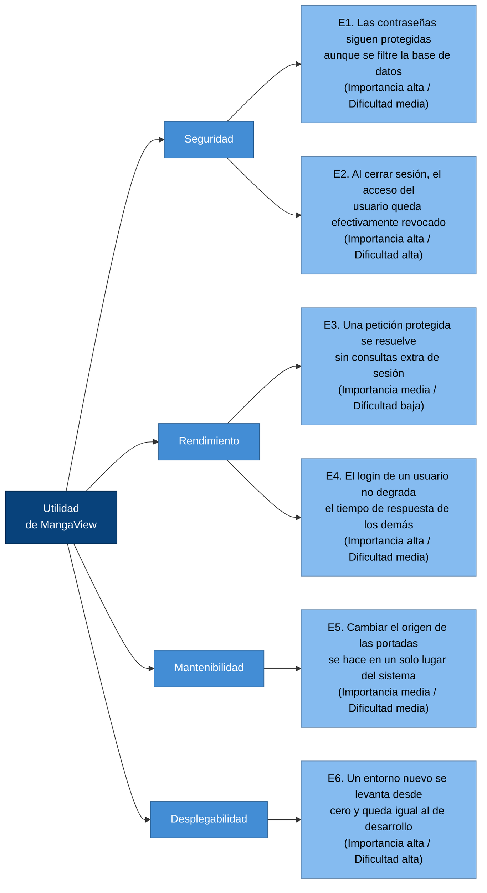

# Evaluación ATAM de la arquitectura de MangaView

| Campo | Valor |
|-------|-------|
| Autor | Roberto |
| Método | ATAM — Architecture Tradeoff Analysis Method |
| Proyecto | MangaView |
| Actividad | Actividad #40 — Proyecto: Documentación final y demo |
| Fecha | 03/08/2026 |
| Estado | `Aceptado` |

---

## Qué es esta evaluación y qué no es

Esta **no es una revisión de código**. No busca errores de sintaxis, formato ni estilo. Lo que se evalúa
aquí son **decisiones arquitectónicas** de MangaView y su efecto sobre los atributos de calidad del
sistema: qué gana el sistema con cada decisión, qué pierde, y qué pasaría si las condiciones cambian.

La diferencia es importante. Un error de código se arregla en una línea y desaparece. Una decisión
arquitectónica condiciona lo que el sistema podrá o no podrá hacer durante el resto de su vida, y
cambiarla después cuesta mucho más caro. Por eso ATAM evalúa decisiones, no líneas.

El método clasifica los hallazgos en tres categorías, y este documento entrega una de cada una:

| Categoría | Definición | Hallazgo |
|-----------|------------|----------|
| **Riesgo** | Una decisión que puede causar un problema si no se atiende | R-01: Aprovisionamiento de datos con once scripts no idempotentes |
| **Trade-off** | Una decisión que mejora un atributo de calidad a costa de otro | T-01: Autenticación sin estado con JWT de 7 días |
| **Punto de sensibilidad** | Un parámetro pequeño cuyo cambio afecta mucho a un atributo de calidad | S-01: El factor de coste de bcrypt fijado en 10 |

Toda afirmación de este documento está respaldada por una línea concreta del repositorio. La arquitectura
evaluada es la descrita en `docs/C4-MangaView.md`, que refleja el sistema tal como se ejecuta hoy.

---

## Atributos de calidad priorizados

ATAM parte de saber **qué le importa al sistema**, porque una decisión solo es buena o mala respecto a un
atributo concreto. Este árbol de utilidad prioriza los escenarios de calidad relevantes para MangaView,
con su importancia para el proyecto y su dificultad técnica estimada.



Los tres hallazgos de esta evaluación atacan los escenarios de mayor importancia y dificultad: **E6** para
el riesgo, **E2 y E3** para el trade-off, y **E1 y E4** para el punto de sensibilidad.

---

## Decisiones arquitectónicas evaluadas

| # | Decisión arquitectónica | Dónde vive en el código | Atributos que toca |
|---|-------------------------|-------------------------|--------------------|
| D1 | Evolucionar el esquema y los datos con scripts imperativos numerados | `backend/src/setup.js` … `setup11.js` | Desplegabilidad, mantenibilidad |
| D2 | Autenticación sin estado con JWT guardado en `localStorage` | `middleware/auth.js`, `usuario.controller.js`, `frontend/index.html` | Seguridad, rendimiento, escalabilidad |
| D3 | Hash de contraseñas con `bcryptjs` y factor de coste 10 | `usuario.controller.js` líneas 8 y 25 | Seguridad, rendimiento |
| D4 | Pool único de conexiones compartido (Singleton) | `config/database.js` | Rendimiento, testeabilidad |
| D5 | Servir el frontend y la API desde el mismo proceso Express | `backend/src/index.js` línea 11 | Simplicidad de despliegue, escalabilidad |
| D6 | SQL embebido en los controladores, sin capa de repositorio | los tres `*.controller.js` | Mantenibilidad, testeabilidad |

De estas seis decisiones, la evaluación profundiza en D1, D2 y D3, que son las que producen los tres
hallazgos requeridos. D4, D5 y D6 se comentan en la sección de no-riesgos y en el ADR.

---

## R-01 · RIESGO

### Decisión evaluada

**D1 — Evolucionar el esquema y los datos de demostración mediante once scripts imperativos numerados
(`setup.js` a `setup11.js`), en lugar de un mecanismo de migraciones versionado e idempotente.**

### Escenario de calidad afectado (E6)

> **Estímulo:** durante la demo final, el evaluador —o yo mismo desde otra computadora— clona el
> repositorio, crea la base de datos vacía y ejecuta los scripts de aprovisionamiento.
> **Respuesta esperada:** la aplicación arranca y el catálogo se muestra con sus ocho títulos y sus
> portadas visibles, igual que en mi máquina de desarrollo.
> **Medida:** el entorno queda reproducido correctamente en un solo intento, sin intervención manual.

### Evidencia en el código

El riesgo no es una suposición: la secuencia de scripts documenta por sí misma el problema. Estos once
archivos no son pasos complementarios de una instalación, sino **intentos sucesivos de corregir a mano la
misma columna**, `mangas.portada_url`:

| Script | Qué le hace a `portada_url` |
|--------|------------------------------|
| `setup2.js` | Inserta 5 mangas con portadas de Wikipedia |
| `setup3.js` | Las reemplaza por URL de Amazon |
| `setup4.js` | Las devuelve a Wikipedia, **revirtiendo `setup3`** |
| `setup5.js` | Las cambia por otras URL de Wikipedia |
| `setup6.js` | Las apunta al SVG generado en `/api/cover/...` |
| `setup7.js` | Descarga las imágenes a disco y apunta a `/covers/<archivo>` |
| `setup8.js` | Apunta Naruto, One Piece y Attack on Titan a `/api/cover/...` |
| `setup9.js` | Devuelve esos tres a URL de Wikipedia, **revirtiendo `setup8`** |
| `setup10.js` | Los apunta a `/covers/<título>` |
| `setup11.js` | Cambia tres de ellos a `/covers/<archivo>.jpg` |

Consecuencia directa: **el estado visible de la aplicación depende de qué script se ejecutó al final**, y
no del contenido del repositorio. Además, los últimos de la cadena están rotos:

1. `setup10.js` línea 7 contiene un error de escritura en la ruta: `/covesr/Demon%20Slayer` en lugar de
   `/covers/...`.
2. `setup10.js` apunta a `/covers/Death%20Note`, sin extensión, mientras que `setup7.js` guardó el archivo
   como `death_note.jpg`.
3. `setup11.js` apunta a `/covers/demon_slayer.jpg` y `/covers/mha.jpg`, pero `setup7.js` descargó esos dos
   archivos como `.png`, no como `.jpg`.
4. **Las rutas de disco no coinciden.** `backend/src/index.js` línea 12 publica la carpeta
   `backend/src/public/covers`, mientras que `setup7.js` línea 7 descarga las imágenes a
   `backend/public/covers`. Son dos carpetas distintas: lo que se descarga nunca se sirve.
5. Ninguna de las dos carpetas está versionada en el repositorio, así que en un clon nuevo `/covers/*`
   responde 404 con o sin scripts.

Y hay un segundo eje del riesgo, la **no idempotencia**. Los `INSERT` de `setup.js` líneas 11 a 13 y de
`setup2.js` línea 5 no llevan `ON CONFLICT`, a diferencia del resto del sistema, que sí lo usa
correctamente en `guardarProgreso` y en `agregarFavorito`. Ejecutar dos veces los scripts de carga
duplica el catálogo, los capítulos y las páginas. No hay forma de saber si ya se ejecutaron: no existe
tabla de control de migraciones ni orden declarado en ningún `package.json` o README.

Por último, el DDL está duplicado: `config/schema.sql` crea las seis tablas y `setup.js` vuelve a crear
cinco de ellas con definiciones escritas por separado. Si mañana cambia una columna, hay dos lugares que
deben modificarse en paralelo y nada garantiza que se mantengan sincronizados.

### Análisis

Lo que convierte esto en un riesgo arquitectónico, y no en un simple conjunto de errores, es que **el
repositorio dejó de ser la fuente de verdad del entorno**. El estado del sistema solo existe en la base de
datos de mi computadora, como resultado acumulado de comandos ejecutados en un orden que no está escrito
en ninguna parte. La arquitectura no tiene un camino definido desde "repositorio limpio" hasta "sistema
funcionando", y ese camino es justamente lo que la actividad exige demostrar en la demo.

El riesgo se materializa con alta probabilidad y en el peor momento posible: al presentar. El síntoma
visible serían portadas rotas en el catálogo, que es la primera pantalla que se ve.

### Atributos de calidad comprometidos

Desplegabilidad y reproducibilidad en primer lugar; mantenibilidad en segundo, porque cambiar el origen de
las portadas hoy implica revisar siete scripts para saber cuál manda (escenario E5); y usabilidad
percibida como efecto final, porque el usuario ve imágenes rotas.

### Mitigación propuesta

| Acción | Efecto |
|--------|--------|
| Consolidar los once scripts en un único `seed.js` idempotente, con `ON CONFLICT DO NOTHING` en los `INSERT` y una sola estrategia de portadas | Ejecutarlo N veces deja siempre el mismo estado |
| Dejar `config/schema.sql` como única fuente del DDL y que el seed lo lea, eliminando el DDL duplicado de `setup.js` | Un solo lugar por cambio de esquema |
| Corregir la ruta de `/covers` para que coincidan `index.js` y el seed, y usar `/api/cover/:titulo` como respaldo cuando el archivo no exista | El catálogo nunca se ve roto en un entorno nuevo |
| Declarar `npm run db:setup` en `backend/package.json` y documentarlo en el README | El camino de instalación queda escrito y verificable |

Esta mitigación se registra como deuda técnica en el ADR (Paso 3) y es la clase de defecto que el pipeline
de integración continua del Paso 4 puede detectar de forma automática.

---

## T-01 · TRADE-OFF

### Decisión evaluada

**D2 — Autenticación sin estado mediante JWT firmado con expiración de 7 días, guardado en el
`localStorage` del navegador, sin almacenamiento de sesiones en el servidor.**

### Los dos atributos en conflicto

Un trade-off no es un error: es una decisión que **mejora un atributo de calidad a costa de otro**. Aquí,
la misma decisión que hace al sistema rápido y escalable es la que le impide revocar accesos.

### Lo que se gana: rendimiento y escalabilidad (escenario E3)

`middleware/auth.js` resuelve la autorización con una única verificación de firma en memoria:

```javascript
const decoded = jwt.verify(token, process.env.JWT_SECRET);
req.usuario = decoded;
```

No hay consulta a PostgreSQL. Cada petición protegida —guardar progreso, ver perfil, listar favoritos—
**se ahorra un viaje completo a la base de datos** respecto a una arquitectura con sesiones en servidor.
En el lector, donde `saveProgress()` se dispara en cada cambio de página, ese ahorro se multiplica por
cada página que el usuario avanza.

La confirmación de que la decisión se tomó de verdad está en el esquema: `config/schema.sql` define seis
tablas y **ninguna es de sesiones**. El servidor no guarda nada del usuario autenticado, lo que permite
reiniciarlo o correr varias instancias en paralelo sin que nadie pierda la sesión.

### Lo que se paga: seguridad (escenario E2)

El precio es que **no existe forma de revocar un token antes de que expire**. El cierre de sesión de
`frontend/index.html` línea 204 es puramente local:

```javascript
function logout(){ localStorage.removeItem('token'); localStorage.removeItem('user'); ... }
```

El token se borra del navegador, pero sigue siendo criptográficamente válido. Si alguien lo copió antes,
`jwt.verify` lo seguirá aceptando durante el resto de los siete días configurados en
`usuario.controller.js` línea 28. No hay lista de revocación, ni versión de token en la tabla `usuarios`,
ni tokens de refresco. Es decir: **cerrar sesión no cierra el acceso**.

El costo se agrava por dónde se guarda el token. Al vivir en `localStorage`, cualquier JavaScript de la
página puede leerlo, y la SPA construye su HTML concatenando datos de la API dentro de `innerHTML` en
`renderGrid` y en `openManga`. Si un título de manga llegara a contener una etiqueta `<script>`, la
superficie de ataque existe y el premio es una sesión válida por hasta siete días.

### Cuantificación del intercambio

| | Con JWT sin estado (decisión actual) | Con sesiones en servidor (alternativa) |
|---|---|---|
| Consultas a la BD por petición protegida | 0 | 1 |
| Estado a replicar entre instancias | Ninguno | Almacén de sesiones compartido |
| Tiempo para revocar un acceso | Hasta 604 800 segundos | Inmediato |
| Efecto real de `logout()` | Solo en el navegador | Cierra el acceso de verdad |

### Análisis

Para el alcance actual de MangaView —un proyecto académico, con datos no sensibles más allá de las
credenciales— **el intercambio está bien elegido y no propongo revertirlo**. Lo que corresponde es
dejarlo documentado como decisión consciente y no como descuido, que es exactamente la diferencia que
ATAM busca establecer.

Si el sistema pasara a producción con usuarios reales, el ajuste de menor costo sería reducir la vida del
token de acceso a minutos y agregar un token de refresco de larga duración. Eso conserva casi todo el
beneficio de rendimiento —la consulta a la base de datos vuelve solo en el refresco, no en cada
petición— y reduce la ventana de exposición de siete días a unos minutos.

---

## S-01 · PUNTO DE SENSIBILIDAD

### Decisión evaluada

**D3 — El factor de coste del hash de contraseñas, fijado en `10` con la librería `bcryptjs`.**

Un punto de sensibilidad es **un parámetro pequeño cuyo cambio afecta mucho a un atributo de calidad**.
Aquí se trata literalmente de un solo dígito, en `usuario.controller.js` línea 8:

```javascript
const hash = await bcrypt.hash(password, 10);
```

Ese `10` es el exponente del número de iteraciones del algoritmo: el trabajo realizado es de 2¹⁰ = 1024
rondas. Cada unidad que se le suma **duplica** el tiempo de cómputo. No es un ajuste lineal.

### Por qué este parámetro es tan sensible

| Valor | Trabajo relativo | Tiempo aproximado por hash | Efecto |
|-------|------------------|----------------------------|--------|
| 6 | 1/16 | ~4 ms | Login instantáneo, hashes 16 veces más baratos de romper por fuerza bruta |
| **10 (actual)** | **1** | **~60–100 ms** | **Equilibrio razonable** |
| 12 | 4 | ~250–400 ms | Mucho más resistente, latencia perceptible |
| 14 | 16 | ~1 000–1 600 ms | Resistencia alta, login inaceptablemente lento |

El parámetro afecta a **dos atributos en direcciones opuestas**: bajarlo mejora el rendimiento y degrada
la seguridad frente a un ataque de fuerza bruta sobre una base de datos filtrada (escenario E1); subirlo
hace lo contrario. Un cambio de cuatro caracteres en el código mueve el comportamiento del sistema en un
factor de dieciséis.

### El agravante específico de esta arquitectura (escenario E4)

Aquí está el hallazgo que hace de este parámetro un punto de sensibilidad **arquitectónico** y no solo una
constante de configuración. El proyecto usa `bcryptjs`, no el paquete nativo `bcrypt`:

```json
"bcryptjs": "^2.4.3"
```

`bcryptjs` es una implementación **escrita íntegramente en JavaScript**. A diferencia del binding nativo,
no delega el cálculo al pool de hilos de libuv: se ejecuta en el hilo principal de Node.js y **bloquea el
event loop** mientras dura. Y como `login` también llama a `bcrypt.compare` en la línea 25, el costo se
paga en cada inicio de sesión, no solo en el registro.

La consecuencia es que el efecto de ese dígito no se limita a la ruta de autenticación: **mientras se
calcula un hash, el servidor no puede atender ninguna otra petición**. Con el valor 10 el bloqueo es de
unas décimas de segundo y pasa desapercibido. Si alguien subiera el factor a 14 buscando más seguridad,
cada login congelaría la API durante más de un segundo para todos los usuarios, y el catálogo y el lector
se volverían lentos por una decisión tomada en el módulo de contraseñas. El parámetro es sensible para la
seguridad **y** para la disponibilidad de todo el sistema.

### Recomendación

Mantener el valor en 10, que es adecuado para el alcance del proyecto, pero **sacarlo del código a una
variable de entorno** (`BCRYPT_ROUNDS`) para que quede visible como decisión y no escondido como número
mágico. Si en el futuro se necesita subirlo, migrar antes de `bcryptjs` al paquete nativo `bcrypt`, que sí
ejecuta el cálculo fuera del hilo principal y desacopla el costo de seguridad del de disponibilidad.

---

## No-riesgos identificados

ATAM también reconoce las decisiones que **están bien tomadas**, para no gastar esfuerzo donde no hace
falta.

1. **El Singleton del pool de conexiones** (`config/database.js`) es correcto. Centraliza la configuración,
   evita abrir conexiones duplicadas y su límite por defecto de 10 conexiones simultáneas es holgado para
   la carga esperada. Su único costo real —dificultar las pruebas unitarias por ser una dependencia
   global— se atiende en el Paso 4 diseñando las pruebas sobre las piezas que no dependen del pool.
2. **El uso de consultas parametrizadas** con `$1`, `$2` en los tres controladores previene inyección SQL
   de forma sistemática. La única excepción es `setup7.js` línea 32, que interpola el título directamente
   en el SQL, pero es un script local con datos fijos escritos por mí, sin entrada de usuario.
3. **El upsert de `guardarProgreso`** con `ON CONFLICT (usuario_id, capitulo_id) DO UPDATE` es idempotente
   y resuelve correctamente el guardado repetido desde el lector. Contrasta con los scripts de
   aprovisionamiento y demuestra que el patrón correcto ya se conoce dentro del proyecto: aplicarlo al
   seed es coherente con lo que ya existe.

---

## Resumen de hallazgos

| ID | Tipo | Decisión | Atributo que mejora | Atributo que compromete | Acción |
|----|------|----------|---------------------|-------------------------|--------|
| R-01 | Riesgo | Once scripts de aprovisionamiento no idempotentes y sin orden declarado | Rapidez de desarrollo en su momento | Desplegabilidad, mantenibilidad | Consolidar en un seed idempotente antes de la demo |
| T-01 | Trade-off | JWT sin estado en `localStorage`, expiración de 7 días | Rendimiento, escalabilidad | Seguridad (imposibilidad de revocar) | Aceptar y documentar; migrar a token corto con refresco si va a producción |
| S-01 | Sensibilidad | Factor de coste de bcrypt igual a 10 sobre `bcryptjs` | — | Seguridad y disponibilidad, en direcciones opuestas | Mantener en 10, externalizar a variable de entorno |

La conclusión general es que la arquitectura de MangaView es sólida en sus decisiones estructurales —la
separación en capas, el pool único, las consultas parametrizadas, el upsert del progreso— y que su punto
débil no está en cómo está construido el sistema, sino en **cómo se reproduce**. El riesgo R-01 es el
único hallazgo que exige acción antes de la demo.

---

## Declaración de uso de IA

Usé IA (Cursor) para recorrer el repositorio de forma sistemática y contrastar cada afirmación de esta
evaluación contra el código fuente, incluyendo la reconstrucción de la cadena de scripts de
aprovisionamiento y la detección de la discrepancia de rutas de la carpeta de portadas. El marco de
análisis ATAM, la priorización de los atributos de calidad y la aceptación del trade-off de autenticación
son criterios propios sobre el proyecto que desarrollé durante el cuatrimestre. Verifiqué archivo por
archivo y línea por línea cada evidencia citada antes de subir este documento.
