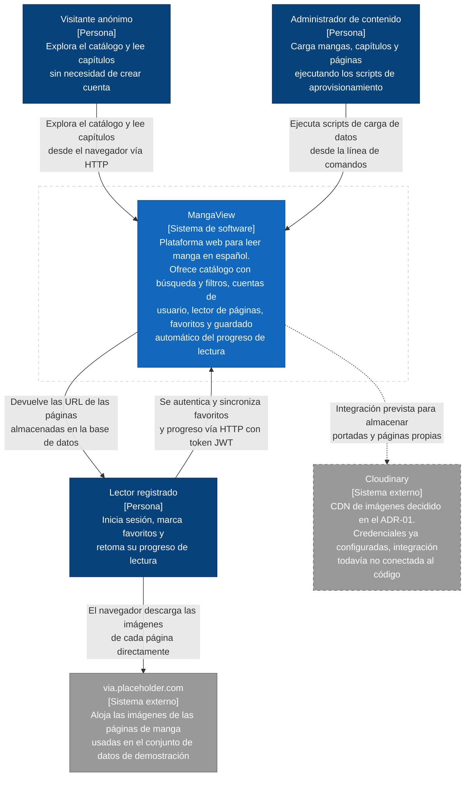
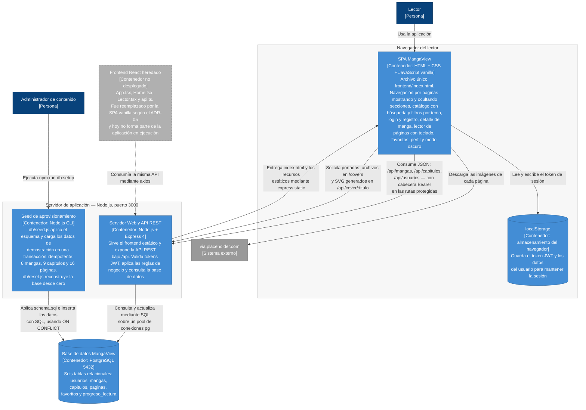
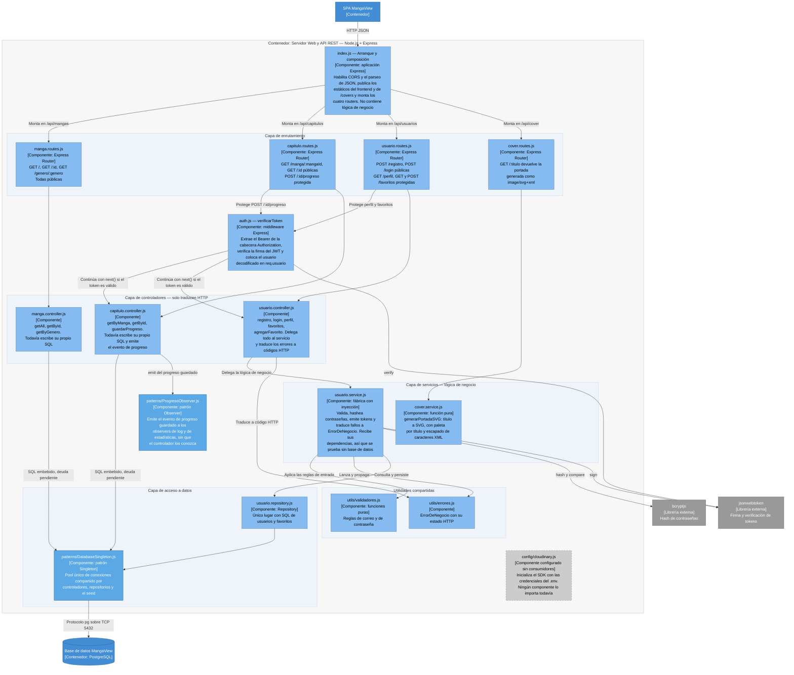
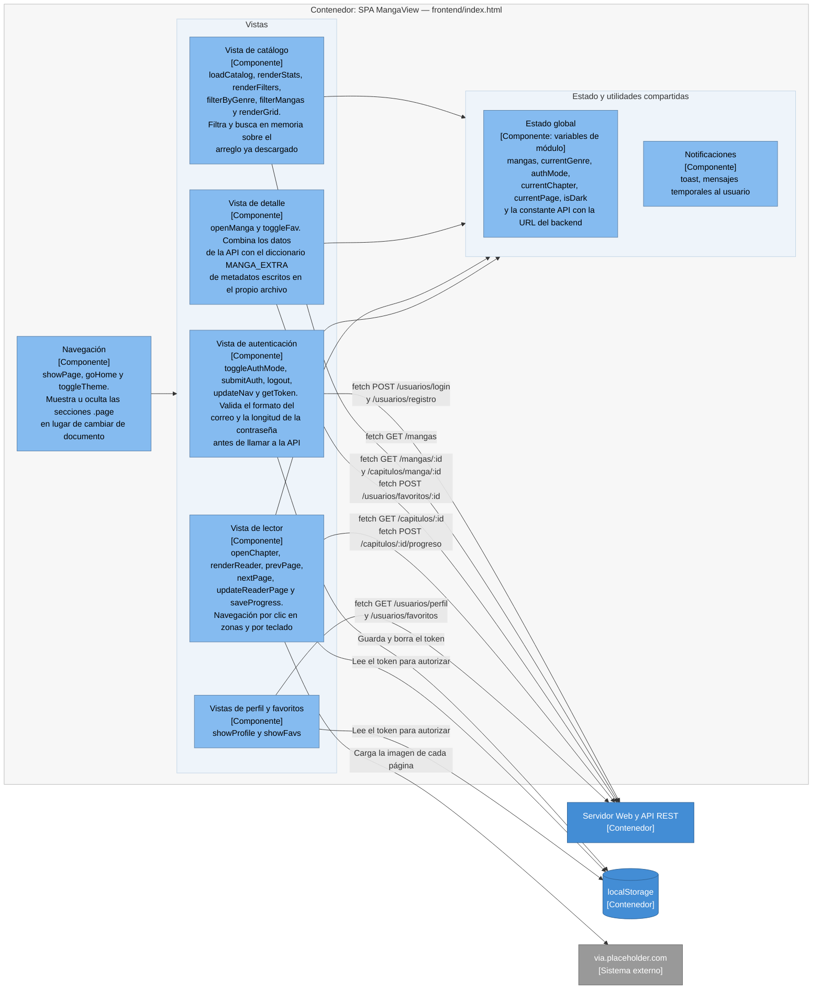

# Modelo C4 de MangaView

| Campo | Valor |
|-------|-------|
| Autor | Roberto |
| Proyecto | MangaView — Plataforma web para leer manga en español |
| Actividad | Actividad #40 — Proyecto: Documentación final y demo |
| Fecha | 03/08/2026 |
| Estado | `Aceptado` |

---

## Sobre este documento

Los diagramas están escritos **como código** en sintaxis Mermaid dentro de este archivo `.md`, de forma que
viven junto al código fuente, se versionan con Git y se renderizan directamente en GitHub. Si la
arquitectura cambia, el diagrama se modifica en el mismo pull request que el código.

Se usa la notación `flowchart` de Mermaid (en lugar de la sintaxis experimental `C4Context`) porque es la
que GitHub renderiza de forma estable. La semántica del modelo C4 se conserva mediante los estereotipos
`[Persona]`, `[Sistema externo]`, `[Contenedor]` y `[Componente]`, y mediante los colores definidos en
`classDef`.

Cada nivel del modelo baja un escalón de zoom sobre el mismo sistema:

| Nivel | Pregunta que responde | Audiencia principal |
|-------|-----------------------|---------------------|
| 1. Contexto | ¿Qué es el sistema y quién lo usa? | Profesor, evaluador, cualquier persona sin contexto técnico |
| 2. Contenedores | ¿De qué piezas grandes ejecutables se compone? | Desarrollador nuevo en el proyecto, responsable de despliegue |
| 3. Componentes | ¿Qué hay dentro de cada pieza? | Yo mismo y quien vaya a modificar el código |

Los diagramas describen el sistema **tal como está implementado hoy en el repositorio**, no como me
gustaría que estuviera. Las diferencias entre lo documentado en ADRs anteriores y lo que realmente
ejecuta el código se listan al final, en la sección *Notas de fidelidad*, y son la entrada para la
evaluación ATAM y la actualización del ADR.

---

## Nivel 1 — Diagrama de Contexto

**¿Para quién es este diagrama?** Para cualquier persona que llega al proyecto sin conocerlo: el profesor
durante la demo, un evaluador o un compañero. No requiere saber nada de Node.js ni de bases de datos.

**¿Qué pregunta responde?** ¿Qué es MangaView, quién lo usa y con qué sistemas externos habla?

En este nivel MangaView es **una sola caja negra**. No aparecen Express, PostgreSQL ni JavaScript, porque
lo que importa aquí es el propósito del sistema y su frontera con el mundo exterior.

### Lectura del diagrama

Hay **tres tipos de usuario y no uno solo**, y esa distinción es una decisión de diseño real que está en el
código: las rutas `GET /api/mangas` y `GET /api/capitulos/:id` son públicas, mientras que `POST
/api/capitulos/:id/progreso`, `GET /api/usuarios/favoritos` y `GET /api/usuarios/perfil` pasan por el
middleware `verificarToken`. Es decir, **leer no requiere cuenta; personalizar sí**. El administrador de
contenido no tiene interfaz gráfica: interactúa con el sistema ejecutando los scripts `setup*.js` con
Node.js.

Cloudinary aparece en gris punteado a propósito. Está declarado en el ADR-01 y configurado en
`backend/src/config/cloudinary.js`, pero ningún controlador lo importa todavía, así que hoy no es una
dependencia en ejecución.

---

## Nivel 2 — Diagrama de Contenedores

**¿Para quién es este diagrama?** Para un desarrollador que acaba de clonar el repositorio y necesita
saber qué procesos tiene que levantar para que la aplicación funcione, y para quien vaya a desplegarla.

**¿Qué pregunta responde?** ¿De qué piezas grandes y ejecutables se compone MangaView, qué tecnología usa
cada una y cómo se comunican entre ellas?

Aquí se abre la caja negra del Nivel 1. Un *contenedor* en C4 es algo que se ejecuta por separado: un
proceso, una aplicación de navegador o una base de datos.

### Lectura del diagrama

El hallazgo más importante de este nivel es que **el servidor Express cumple dos papeles a la vez**: es
servidor de archivos estáticos del frontend y es la API REST. Esto ocurre en las primeras líneas de
`backend/src/index.js`, donde `express.static` publica la carpeta `frontend`. Fue una decisión
deliberada del ADR-05 para simplificar el arranque a un solo `npm run dev`, y es la razón por la que solo
hay un proceso que levantar.

La sesión no vive en el servidor sino en `localStorage` del navegador: el token JWT firmado con
`expiresIn: '7d'` se guarda del lado del cliente y se envía en cada petición protegida. El servidor no
mantiene estado de sesión, lo que lo hace horizontalmente escalable pero impide invalidar un token antes
de que expire.

El **frontend React heredado** se dibuja en gris punteado porque existe en el repositorio (`frontend/src/`
y su propio `package.json` con `react-scripts`) pero no se ejecuta ni se sirve. Es deuda técnica visible y
se documenta aquí de forma explícita en lugar de ocultarla.

---

## Nivel 3 — Diagrama de Componentes: Servidor Web y API REST

**¿Para quién es este diagrama?** Para mí y para cualquiera que vaya a modificar el backend. Es el nivel
que se usa para decidir en qué archivo tocar antes de escribir código.

**¿Qué pregunta responde?** ¿Qué hay dentro del contenedor de la API, qué responsabilidad tiene cada
componente y cómo fluye una petición desde que entra hasta que llega a la base de datos?

### Lectura del diagrama

El flujo de una petición sigue el estilo en capas declarado en el ADR-03, y en el módulo de usuarios ese
estilo ya está completo: `index.js` → router → middleware de autenticación si la ruta es protegida →
controlador → servicio → repositorio → `DatabaseSingleton` → PostgreSQL. Cada eslabón tiene una sola
razón para cambiar.

Los dos patrones GOF documentados en el ADR-04 aparecen aquí en azul más intenso, porque son decisiones de
diseño explícitas y no simples archivos: el **Singleton** es el punto único por el que pasa todo el
acceso a datos, y el **Observer** es la única flecha que sale de un controlador sin esperar respuesta
—`capitulo.controller.js` emite el evento de progreso y no sabe quién lo escucha.

El diagrama también muestra con honestidad **lo que queda por hacer**. Las flechas etiquetadas como `SQL
embebido, deuda pendiente` salen de `manga.controller.js` y de `capitulo.controller.js`: esos dos
controladores siguen escribiendo SQL directamente contra el Singleton, sin pasar por un repositorio. La
separación en capas se aplicó primero al módulo de usuarios porque era el que mezclaba más
responsabilidades; extenderla a los otros dos está registrado como deuda técnica planificada en el ADR.

Por último, `cover.service.js` es una función pura sin ninguna dependencia: entra un título y sale un SVG.
Esa forma no es casual, es lo que permite probarlo de manera unitaria sin levantar Express ni PostgreSQL.

---

## Nivel 3 — Diagrama de Componentes: SPA MangaView

**¿Para quién es este diagrama?** Para quien vaya a modificar la interfaz. Como todo el frontend vive en un
único archivo `index.html`, sin este diagrama no hay forma de orientarse dentro de él.

**¿Qué pregunta responde?** ¿Qué hay dentro del contenedor del frontend y cómo se organizan las funciones
que lo componen?

Aquí un *componente* no es un archivo, porque no hay módulos: son los grupos de funciones y el estado
global que conviven en el bloque `<script>` de `frontend/index.html`.

### Lectura del diagrama

La SPA sigue un patrón claro por vista: cada vista descarga sus datos con `fetch`, los escribe en el
estado global y genera HTML con plantillas de cadena. El filtrado y la búsqueda del catálogo ocurren en
el cliente sobre el arreglo `mangas` ya descargado, sin volver al servidor, lo que da una respuesta
instantánea a costa de traer todo el catálogo de una sola vez.

Dos elementos del diagrama son puntos de atención: la constante `API` está fijada a
`http://localhost:3000/api` dentro del archivo, y el diccionario `MANGA_EXTRA` contiene metadatos de los
ocho mangas escritos a mano en el frontend en lugar de vivir en la base de datos.

---

## Trazabilidad entre niveles

| Elemento del Nivel 1 | Se descompone en el Nivel 2 | Se detalla en el Nivel 3 |
|----------------------|-----------------------------|--------------------------|
| MangaView (sistema) | SPA, Servidor Web y API REST, Base de datos PostgreSQL, Seed de aprovisionamiento | Componentes de la API y componentes de la SPA |
| Lector registrado | Interactúa con la SPA; su sesión vive en localStorage | Vista de autenticación, middleware `verificarToken` y `usuario.service.js` |
| Administrador de contenido | Ejecuta el Seed de aprovisionamiento | `db/seed.js`, `db/reset.js` y `db/datos-demo.js` |
| Cloudinary | Sin contenedor asociado, integración pendiente | `config/cloudinary.js`, configurado sin consumidores |

---

## Notas de fidelidad: diferencias entre lo documentado y lo implementado

Estas observaciones surgieron al construir los diagramas a partir del código real. Fueron la entrada
directa para la evaluación ATAM y para la refactorización posterior, así que se conservan aquí junto con su
estado actual. Este documento describe la arquitectura viva: si algo se resuelve, se actualiza.

| # | Observación al levantar los diagramas | Estado |
|---|----------------------------------------|--------|
| 1 | El `README.md` y los ADR-01 a ADR-03 describen un frontend en React + TypeScript, pero el que se sirve es la SPA en JavaScript vanilla del ADR-05. Los archivos de React siguen en el repositorio sin ejecutarse | **Pendiente** — deuda registrada en el ADR |
| 2 | Cloudinary está documentado y configurado, pero ningún componente lo importa | **Pendiente** — integración no realizada, se mantiene la decisión del ADR-01 |
| 3 | Once scripts `setup.js` a `setup11.js` hacían de migraciones, con DDL duplicado y sin orden declarado | **Resuelto** — consolidados en `db/seed.js`, idempotente y transaccional |
| 4 | No hay capa de repositorio ni de modelos; el SQL vive en los controladores | **Resuelto en parte** — aplicado al módulo de usuarios; `manga` y `capitulo` siguen pendientes |
| 5 | No existen pruebas unitarias ni pipeline de integración continua | **Resuelto** — pruebas con Arrange-Act-Assert y pipeline en `.github/workflows/ci.yml` |
| 6 | El manejo de errores devuelve `err.message` con estado 500, exponiendo detalles de la base de datos | **Resuelto en el módulo de usuarios** — errores previstos con su propio estado y genéricos para el resto |
| 7 | La URL del backend está escrita en el código del frontend como `http://localhost:3000/api` | **Pendiente** — deuda registrada en el ADR |
| 8 | Los patrones GOF del ADR-04 estaban implementados solo en la rama `patrones-gof`, sin fusionar | **Resuelto** — `DatabaseSingleton` y `ProgresoObserver` integrados en la línea principal |

---

## Declaración de uso de IA

Usé IA (Cursor) como apoyo para analizar la estructura del repositorio y traducir la arquitectura
existente a la notación C4 en Mermaid. Las decisiones arquitectónicas representadas en los diagramas
corresponden al proyecto MangaView que desarrollé durante el cuatrimestre. Verifiqué que cada elemento,
relación y endpoint dibujado coincide con el código fuente antes de subir este documento.
